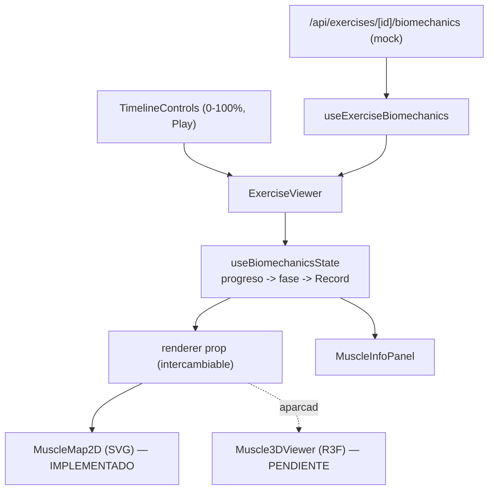

# Visor Biomecánico (activación muscular + ejecución 3D)

Documento de referencia del módulo "visor biomecánico" de BE A GAINER. Captura el estado actual, cómo funciona, las decisiones tomadas y la hoja de ruta para retomarlo. Última actualización: jun 2026.

> Estado en una línea: **Fase 1 (visor 2D de activación muscular) está implementada y validada en Docker. Toda la parte 3D/animación está diseñada y documentada, pero APARCADA (no implementada, sin dependencias instaladas).**

---

## 1. Objetivo del módulo

Reproducir la ejecución correcta de un ejercicio y mostrar dinámicamente qué músculos se activan en cada fase del movimiento (estilo "Strength" de Muscle & Motion / FitCraft), de forma escalable a muchos ejercicios.

Decisión arquitectónica central: **separar el cerebro de la piel**. Un núcleo agnóstico calcula la activación muscular a partir del progreso (0-100%); los renderers (2D hoy, 3D mañana) solo dibujan. Así se puede empezar en 2D y escalar a 3D sin reescribir la lógica ni el contrato de datos.

---

## 2. Estado actual: Fase 1 (IMPLEMENTADA)

Visor 2D interactivo: el usuario mueve un slider (o da Play) y ve qué músculos se activan en cada fase, con siluetas frontal y posterior que se tiñen de rojo según la intensidad.

### Archivos creados (ninguno existente fue modificado; feature aislada)

Capa de datos (compartida 2D/3D):
- [lib/api/contracts/biomechanics.ts](../lib/api/contracts/biomechanics.ts) — tipos `MuscleGroup`, `MuscleRole`, `ExercisePhase`, `ExerciseBiomechanics`.
- [lib/biomechanics/muscle-map.ts](../lib/biomechanics/muscle-map.ts) — única fuente de verdad: labels en ES, `svgRegions` (2D) y `meshName` (3D futuro), colores (`ACTIVE_COLOR`, `BASE_COLOR`, `ANTAGONIST_FACTOR`).
- [lib/biomechanics/exercise-dataset.ts](../lib/biomechanics/exercise-dataset.ts) — diccionario estático con 3 ejercicios (`deadlift_01`, `squat_01`, `bench_01`). Escalar = agregar datos, no código.

Núcleo + fetch:
- [hooks/use-biomechanics-state.ts](../hooks/use-biomechanics-state.ts) — el cerebro: `progress (0-100) -> fase activa -> Record<MuscleGroup, number>` (0..1 por músculo). Sin DOM/SVG/WebGL, reutilizable por el futuro renderer 3D. Agonistas/sinergistas reciben `intensidad`; antagonistas `intensidad * ANTAGONIST_FACTOR`.
- [hooks/use-exercise-biomechanics.ts](../hooks/use-exercise-biomechanics.ts) — fetch con `AbortController` y estados `data/isLoading/error`.
- [app/api/exercises/[id]/biomechanics/route.ts](../app/api/exercises/[id]/biomechanics/route.ts) — endpoint mock `GET` con validación de `id` (regex) y errores genéricos (400/404).

Renderer 2D + UI:
- [components/biomechanics/renderer-types.ts](../components/biomechanics/renderer-types.ts) — interfaz `MuscleRendererProps` (contrato común 2D/3D) y `RendererKind = 'map2d' | 'viewer3d'`.
- [components/biomechanics/body-svg.tsx](../components/biomechanics/body-svg.tsx) — siluetas SVG frontal y posterior; cada músculo es un path con `id` = `svgRegionId`.
- [components/biomechanics/muscle-map-2d.tsx](../components/biomechanics/muscle-map-2d.tsx) — implementa `MuscleRendererProps`; interpola color `BASE_COLOR -> ACTIVE_COLOR` según activación.
- [components/biomechanics/timeline-controls.tsx](../components/biomechanics/timeline-controls.tsx) — `Slider` (Radix) con scrub bidireccional + Play/Pause con `requestAnimationFrame` + Reiniciar + marcas de fase.
- [components/biomechanics/muscle-info-panel.tsx](../components/biomechanics/muscle-info-panel.tsx) — panel con ejercicio, fase y agonista/sinergista/antagonista.
- [components/biomechanics/exercise-viewer.tsx](../components/biomechanics/exercise-viewer.tsx) — orquestador. Estado `progress`/`isPlaying`. Prop `renderer` (`map2d` por defecto; `viewer3d` es un placeholder a la espera de la Fase 2). Props `{ exerciseId; className?; embedded? }`.

Demo:
- [app/lab/biomech/page.tsx](../app/lab/biomech/page.tsx) + [app/lab/biomech/page-client.tsx](../app/lab/biomech/page-client.tsx) — ruta `/lab/biomech` con selector de ejercicio. Standalone, sin shells de auth.

### Cómo se valida (cumple regla task-validation-and-testing)
- `pnpm typecheck` — los archivos del módulo no producen errores (hay 2 errores PREEXISTENTES y ajenos: `socket.io-client` ausente en el `node_modules` del host; dentro de Docker se instala vía lockfile y la app corre bien).
- `pnpm exec eslint components/biomechanics` — 0 problemas.
- Docker (flujo real del proyecto):
  - `docker compose -p fittrack ps` para confirmar `fittrack-frontend` (3000) arriba.
  - El código está montado por bind mount con HMR (polling), así que los archivos nuevos se sincronizan sin rebuild.
  - IMPORTANTE: tras crear un **route handler nuevo**, hay que `docker compose -p fittrack restart fittrack-frontend` porque Turbopack cachea el árbol de rutas (síntoma: el endpoint da 404 aunque el archivo exista). Las páginas sí se toman en caliente.
  - Resultados verificados: `deadlift_01/squat_01/bench_01` -> 200; `no_existe` -> 404; `bad id` -> 400; `/lab/biomech` -> 200.
- Prueba manual visual en `http://localhost:3000/lab/biomech`: mover slider tiñe músculos por fase; Play anima y reinicia al 100%; panel sincronizado al cruzar el 50%.

---

## 3. Decisiones tomadas y aprendizajes (por qué llegamos aquí)

- **El stack real es Next.js 16 + React 19 + TypeScript** (no Vite/JSX como decía el prompt original). El visor se hizo en `.tsx` alineado al repo.
- **2D primero, 3D después (híbrido).** El mapa 2D escala por datos y es la decisión sensata de producto; el 3D es más caro por el contenido (assets), no por el código.
- **El cuello de botella del 3D es el ASSET, no el código.** Animar y/o modelar músculos por ejercicio es trabajo de contenido.
- **Mixamo da MOVIMIENTO + un cuerpo de UNA sola malla; NO trae músculos separados ni catálogo de ejercicios de gimnasio ni equipamiento (barra/mancuerna).** Sirve para riggear y para clips genéricos, no para clonar Muscle & Motion.
- **Muscle & Motion / FitCraft** usan anatomía 3D premium (modelos por capas, animación autoria/mocap). Reproducir ese "look" es un proyecto de contenido grande, fuera de alcance inicial.
- **La demo `pose-to-3d.vercel.app` que se probó NO es lo mismo que el plan:** usa MediaPipe para estimar la pose desde un VIDEO (markerless mocap), por eso el movimiento salía inexacto/ruidoso. Nuestro plan NO usa estimación desde video; el movimiento sería determinista.
- **El muñeco de prueba es desechable:** su diseño/material/modelo se puede cambiar luego sin tocar la lógica (ver Fase 2).

---

## 4. Fase 2 (APARCADA): mostrar la EJECUCIÓN del movimiento

El visor 2D muestra QUÉ músculos trabajan, pero no anima el cuerpo ejecutando el ejercicio. Para "ver la ejecución" hay tres caminos. Resumen honesto de cada uno:

| Criterio | A. Reproducir clip | B. Procedural (FK/IK) | C. Anatomía Z-Anatomy |
|----------|--------------------|------------------------|------------------------|
| De dónde sale el movimiento | Clip de animación (Mixamo/mocap) | Ángulos por fase definidos como datos | Modelo anatómico animado |
| Exactitud vs un video | Idéntico al clip | Aproximación que afinamos | Alta + músculos visibles |
| Esfuerzo por ejercicio | Bajo (descargar/animar clip) | Medio (definir poses) | Muy alto |
| Escala a muchos ejercicios | Buena | Buena (datos en DB) | Mala/cara |
| Assets `.glb` | Uno por ejercicio | Solo el modelo base | Modelo anatómico |
| Activación muscular sobre el cuerpo 3D | En mapa 2D al lado | En mapa 2D al lado | Directo en el cuerpo |

Recomendación al retomar: **si vamos a tener clips de los ejercicios, el camino A (reproducir clip) es el más fiel y simple**; el procedural (B) es el plan B para ejercicios sin clip. La anatomía (C) queda como aspiracional.

### Cómo funciona el camino A (reproducir clip) — el más recomendado
1. Convertir el `.fbx` de Mixamo a `.glb` (Blender o `npx fbx2gltf`), o cargar `.fbx` con `useFBX` de drei.
2. `useGLTF(modeloUrl)` + `useAnimations` exponen el `mixer`/`actions`.
3. El slider scrollea la animación: `action.paused = true; action.time = (progress/100) * clip.duration; mixer.update(0)`. Con Play se avanza `progress` por `requestAnimationFrame`.
4. El mismo `progress` alimenta `use-biomechanics-state` para el mapa muscular 2D al lado.

### Cómo funciona el camino B (procedural FK) — alternativa
Un modelo rigeado es una malla pegada a un esqueleto; rotar un hueso deforma la malla.
1. Cargar modelo base (Mixamo, sin animación) -> `skeleton.bones`.
2. Por fase guardar `poseInicio` y `poseFin` (ángulos por articulación) como datos.
3. `bone-map` traduce articulación semántica -> hueso Mixamo (ej. `cadera -> mixamorigHips`).
4. Cada frame (`useFrame`): `progress` -> fase activa -> `t` -> interpolar rotaciones (`lerp`/`slerp`) -> asignar a los huesos. three deforma la malla.
5. Mejora opcional: IK con `CCDIKSolver` (`three/examples/jsm/animation/CCDIKSolver`) para fijar manos/pies a objetivos.

### ¿Se puede cambiar el diseño del muñeco? Sí.
- Cambiar el modelo entero: reemplazar el `.glb`/URL. Mismo esqueleto Mixamo = cero cambios de código; otro rig = actualizar `bone-map`.
- Cambiar colores/material/piel (ej. estilo del tema, look translúcido): por código sobre los materiales de three, en runtime.
- El valor está en el motor (slider -> pose/clip -> activación), independiente de cómo se vea el modelo.

### Pasos de implementación pendientes (cuando se retome)
1. `pnpm add @react-three/fiber@^9 @react-three/drei@^10` (React 19; `three@0.167` ya instalado; verificar peer deps y `pnpm typecheck`).
2. Colocar el modelo base en `public/models/` (binario NUNCA en DB; en DB solo la URL, patrón ya usado en `Exercise.animation_url`).
3. Crear `components/biomechanics/muscle-3d-viewer.tsx` implementando `MuscleRendererProps`: `Canvas` vía `next/dynamic` `ssr:false` + `OrbitControls` + `Suspense` + `useGLTF`.
4. Camino A: enganchar `useAnimations` al slider. / Camino B: crear `lib/biomechanics/bone-map.ts`, `hooks/use-procedural-pose.ts` y `components/biomechanics/procedural-rig.tsx`, y extender el contrato con `JointKey`, `JointAngles`, `poseInicio?/poseFin?`.
5. Activar con `renderer="viewer3d"` en [components/biomechanics/exercise-viewer.tsx](../components/biomechanics/exercise-viewer.tsx) (el switch ya existe).
6. (Opcional) Pose-editor en `/lab/biomech/pose-editor` para autorar poses por fase visualmente.

---

## 5. Backend (futuro): persistir en base de datos

Hoy los datos vienen de un mock ([lib/biomechanics/exercise-dataset.ts](../lib/biomechanics/exercise-dataset.ts)). Para producción:
- **Binarios `.glb`:** filesystem/CDN (`public/models/` en dev), NO en la DB. En la DB solo la URL.
- **Metadata (fases, músculos, poses):** tabla `exercise_biomechanics` (1:1 con `exercises`), `fases` en JSONB. Endpoint Flask `GET /api/exercises/:id/biomechanics` leyendo de DB (reemplaza el route handler mock de Next). Rutas delgadas + service + migración Alembic + errores genéricos (reglas backend-architecture / database-security).
- El contrato `ExerciseBiomechanics` ya tiene `modeloUrl` y `clip`, listos para esto sin tocar el frontend.

---

## 6. Cómo retomar rápido
1. Abrir `/lab/biomech` en Docker para ver la Fase 1 funcionando.
2. Decidir camino de ejecución 3D: A (clip, recomendado si hay clips) o B (procedural).
3. Seguir los "pasos de implementación pendientes" de la sección 4.
4. Recordar el `restart fittrack-frontend` al añadir route handlers nuevos.

Planes relacionados (área de planes de Cursor): `Visor Biomecánico Híbrido` y `Visor 3D Procedural`.
