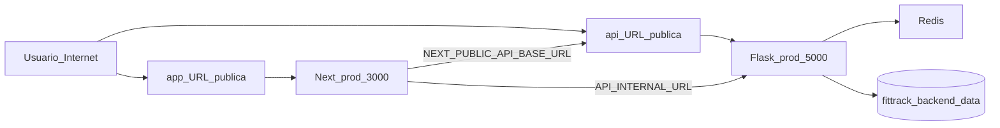

# Despliegue en Mac Mini + Cloudflare Tunnel

Guía para exponer FitTrack desde un servidor en casa (Mac Mini) o hacer un **dry run** en Windows antes de migrar. No incluye secretos reales: usa las plantillas `.env.hosting.example` y `backend/.env.hosting.example`.

## Arquitectura



- **Desarrollo diario:** [docker-compose.yml](../docker-compose.yml) (`next dev`, bind mounts).
- **Hosting / prod:** [docker-compose.prod.yml](../docker-compose.prod.yml) (`next build` + `next start`, sin montar código fuente).
- **Exposición pública:** Cloudflare Tunnel hacia `127.0.0.1:3000` (app) y `127.0.0.1:5000` (api).

---

## Requisitos

### Mac Mini (producción en casa)

| Componente | Notas |
|------------|--------|
| Docker Desktop | Mismo flujo que en Windows |
| Git | Clonar y actualizar el repo |
| cloudflared | [Descargas Cloudflare](https://developers.cloudflare.com/cloudflare-one/connections/connect-networks/downloads/) |
| Ollama (opcional) | `ollama pull granite4.1:3b` para coach Titan |
| RAM | 16 GB recomendado con Docker + Ollama |

### Dry run en Windows (ahora)

- Docker Desktop en ejecución
- Puertos `3000` y `5000` libres en localhost
- `cloudflared` instalado para prueba con quick tunnel

---

## Archivos clave

| Archivo | Propósito |
|---------|-----------|
| [docker-compose.prod.yml](../docker-compose.prod.yml) | Stack producción (Next prod, Flask prod, Redis) |
| [docker-entrypoint.frontend.prod.sh](../docker-entrypoint.frontend.prod.sh) | Build y arranque Next en producción |
| [.env.hosting.example](../.env.hosting.example) | Plantilla frontend → copiar a `.env.hosting` |
| [backend/.env.hosting.example](../backend/.env.hosting.example) | Plantilla backend → copiar a `backend/.env` |
| [deploy/cloudflared.quick-tunnel.example.sh](../deploy/cloudflared.quick-tunnel.example.sh) | Comandos quick tunnel |
| [deploy/cloudflared.config.yml.example](../deploy/cloudflared.config.yml.example) | Tunnel nombrado (dominio fijo) |
| [deploy/backup-data.sh.example](../deploy/backup-data.sh.example) | Backup volumen de datos |
| [deploy/restore-data.sh.example](../deploy/restore-data.sh.example) | Restaurar datos (migración) |

---

## Fase A — Dry run local (sin tunnel)

### 1. Preparar variables

```powershell
# Desde la raíz del repo
Copy-Item .env.hosting.example .env.hosting
Copy-Item backend\.env.hosting.example backend\.env
```

Edita `backend/.env`:

- Sustituye `JWT_SECRET_KEY` por un valor seguro: `openssl rand -hex 32`
- Deja `CORS_ORIGINS` y `FRONTEND_URL` en `http://localhost:3000` para smoke test local
- Deja `NEXT_PUBLIC_API_BASE_URL=http://localhost:5000` en `.env.hosting`

### 2. Levantar stack prod

```powershell
docker compose -p fittrack -f docker-compose.prod.yml config
docker compose -p fittrack -f docker-compose.prod.yml up --build -d
```

El primer arranque puede tardar varios minutos (`next build` dentro del contenedor).

### 3. Comprobar salud

```powershell
curl http://127.0.0.1:5000/api/health
# Esperado: {"status":"ok"}

# Frontend
# http://127.0.0.1:3000
```

### 4. Apagar

```powershell
docker compose -p fittrack -f docker-compose.prod.yml down
```

**Nota:** Si ya tienes el stack de desarrollo (`docker-compose.yml`) en el mismo proyecto, usa el mismo `-p fittrack` o detén uno antes de levantar el otro (comparten nombres de contenedor).

---

## Fase B — Quick tunnel (URLs temporales)

Las URLs `*.trycloudflare.com` **cambian** cada vez que reinicias `cloudflared`. Sirve para aprender y probar desde el móvil; no para producción estable.

### 1. Stack prod en localhost

```powershell
docker compose -p fittrack -f docker-compose.prod.yml up -d
```

Los puertos están ligados a `127.0.0.1` (solo accesibles desde tu máquina + tunnel).

### 2. Dos tunnels (dos terminales)

```powershell
# Terminal 1 — frontend
cloudflared tunnel --url http://127.0.0.1:3000

# Terminal 2 — backend
cloudflared tunnel --url http://127.0.0.1:5000
```

Anota las dos URLs `https://....trycloudflare.com`.

### 3. Actualizar env y reiniciar

En `.env.hosting`:

```env
NEXT_PUBLIC_API_BASE_URL=https://<url-del-backend-tunnel>
```

En `backend/.env`:

```env
CORS_ORIGINS=https://<url-del-frontend-tunnel>
FRONTEND_URL=https://<url-del-frontend-tunnel>
```

Recrear contenedores afectados:

```powershell
docker compose -p fittrack -f docker-compose.prod.yml up -d --force-recreate fittrack-frontend fittrack-backend
```

### 4. Checklist manual (desde móvil con datos móviles)

- [ ] Abrir URL del **frontend** tunnel en el navegador
- [ ] Registro o login con API real
- [ ] Navegar a una ruta atleta protegida (`/dashboard`, `/profile`)
- [ ] Probar subida de comprobante de pago (si aplica)
- [ ] Comprobar notificaciones / soporte (Socket.IO vía URL del API tunnel)
- [ ] Titan: si Ollama no está activo, debe responder con fallback (no error 500)

---

## Fase C — Migración a Mac Mini

### 1. Preparar la Mac

1. Instalar Docker Desktop, Git, cloudflared
2. (Opcional) Instalar Ollama y el modelo `granite4.1:3b`
3. Clonar el repositorio

### 2. Copiar configuración y datos

**Config (sin secretos en Git):**

```bash
cp .env.hosting.example .env.hosting
cp backend/.env.hosting.example backend/.env
# Editar backend/.env: JWT_SECRET_KEY, CORS_ORIGINS, FRONTEND_URL
# Editar .env.hosting: NEXT_PUBLIC_API_BASE_URL
```

**Datos (opcional, desde Windows):**

```bash
# En Windows (Git Bash o WSL), con stack detenido:
./deploy/backup-data.sh.example ./backups/migracion.tar.gz

# Copiar el .tar.gz a la Mac (USB, scp, etc.)
# En la Mac:
cp deploy/restore-data.sh.example deploy/restore-data.sh
chmod +x deploy/restore-data.sh
docker compose -p fittrack -f docker-compose.prod.yml down
./deploy/restore-data.sh ./backups/migracion.tar.gz
```

### 3. Levantar y exponer

```bash
docker compose -p fittrack -f docker-compose.prod.yml up --build -d
```

Quick tunnel (igual que Fase B) o tunnel nombrado (Fase D).

### 4. Actualizaciones habituales

```bash
git pull
docker compose -p fittrack -f docker-compose.prod.yml up -d --build
```

---

## Fase D — Dominio fijo en Cloudflare

Cuando tengas dominio en Cloudflare:

1. `cloudflared tunnel create fittrack`
2. Configurar DNS: `app.tudominio.com`, `api.tudominio.com`
3. Usar [deploy/cloudflared.config.yml.example](../deploy/cloudflared.config.yml.example) como base
4. Ejecutar tunnel como servicio (launchd en macOS)

Variables estables:

```env
# .env.hosting
NEXT_PUBLIC_API_BASE_URL=https://api.tudominio.com
TITAN_RATELIMIT_REDIS_URL=redis://fittrack-redis:6379

# backend/.env
CORS_ORIGINS=https://app.tudominio.com
FRONTEND_URL=https://app.tudominio.com
```

### Headers recomendados en reverse proxy (Cloudflare/nginx)

Además de los headers definidos en Next (`X-Frame-Options`, `nosniff`, `Referrer-Policy`,
`Permissions-Policy`), añade en el borde:

- `Strict-Transport-Security: max-age=31536000; includeSubDomains; preload`
- CSP de borde (iniciar en report-only si hay riesgo de romper UI):
  - `default-src 'self'`
  - `connect-src 'self' https://api.tudominio.com`
  - `img-src 'self' data: blob: https://api.tudominio.com`

Si usas Cloudflare, configura estas cabeceras con Transform Rules o en el proxy aguas arriba.

---

## Matriz de variables

| Variable | Dev (`docker-compose.yml`) | Prod local | Prod + tunnel |
|----------|---------------------------|------------|---------------|
| `NODE_ENV` | development (next dev) | production | production |
| `ENVIRONMENT` (Flask) | development | production | production |
| `NEXT_PUBLIC_API_BASE_URL` | `http://localhost:5000` | `http://localhost:5000` | URL pública del API |
| `API_INTERNAL_URL` | `http://fittrack-backend:5000` | igual | igual |
| `CORS_ORIGINS` | `http://localhost:3000` | `http://localhost:3000` | URL pública del frontend |
| `FRONTEND_URL` | `http://localhost:3000` | `http://localhost:3000` | URL pública del frontend |
| `JWT_SECRET_KEY` | dev (warning) | **obligatorio seguro** | **obligatorio seguro** |
| `JWT_COOKIE_SECURE` | False | True | True |
| `RATELIMIT_STORAGE_URI` | memory (dev) | `redis://fittrack-redis:6379` | igual |
| `SEED_DEMO_TRAINERS` | true (dev) | false | false |

---

## Troubleshooting

### El frontend carga pero la API falla (CORS / network error)

- El navegador remoto **no** puede usar `localhost:5000`. `NEXT_PUBLIC_API_BASE_URL` debe ser la URL pública del tunnel del backend.
- `CORS_ORIGINS` en `backend/.env` debe coincidir exactamente con la URL del frontend (sin barra final).
- Tras cambiar env: `--force-recreate` en frontend y backend.

### Backend no arranca: `JWT_SECRET_KEY debe definirse...`

- En producción no se permite el secret de desarrollo. Genera uno nuevo en `backend/.env`.

### Socket.IO no conecta

- El cliente usa `getApiBaseUrl()` → misma URL que el API tunnel.
- Comprueba que el tunnel del backend sigue activo y que cloudflared no fue reiniciado (URL nueva).

### Titan responde `source: fallback`

- Ollama no está en el host o no es alcanzable desde Docker.
- En Mac/Windows: `OLLAMA_BASE_URL=http://host.docker.internal:11434` y `extra_hosts` en compose prod.
- Verifica: `ollama serve` y `ollama list` en el host.

### Conflicto dev vs prod

- Ambos compose usan contenedores `fittrack-frontend` / `fittrack-backend`. Detén uno antes de levantar el otro:
  ```powershell
  docker compose -p fittrack down
  docker compose -p fittrack -f docker-compose.prod.yml up -d
  ```

### Build de Next falla en prod

- Revisa logs: `docker compose -p fittrack -f docker-compose.prod.yml logs fittrack-frontend`
- Ejecuta localmente `pnpm run build` para ver errores de TypeScript antes del build en Docker.

---

## Backups

Volumen persistente: `fittrack_backend_data` (SQLite bajo `/data`, comprobantes, media de ejercicios).

```bash
cp deploy/backup-data.sh.example deploy/backup-data.sh
chmod +x deploy/backup-data.sh
./deploy/backup-data.sh
```

Programa backups periódicos en la Mac Mini (cron o Time Machine + script del volumen).

---

## Validación ejecutada en el repo

Al implementar esta guía, ejecutar como mínimo:

1. `docker compose -f docker-compose.prod.yml config`
2. `docker compose -p fittrack -f docker-compose.prod.yml up --build -d`
3. `GET /api/health` en `127.0.0.1:5000`
4. Smoke test frontend en `127.0.0.1:3000`
5. Quick tunnel: checklist manual documentado en Fase B
6. Completar checklist en [PRODUCTION_READINESS.md](./PRODUCTION_READINESS.md)
