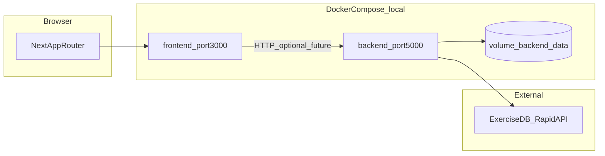

# Contexto del proyecto FitTrack

Documento de referencia para trabajo en frontend, backend, Docker y pruebas. **No incluye secretos:** usa solo `backend/.env.example` como plantilla; los valores reales viven en `backend/.env` (local) y no deben copiarse a la documentación.

---

## 1. Resumen ejecutivo

- **Frontend:** Next.js 16 (App Router), React 19, Tailwind v4, componentes en `components/ui` (shadcn/Radix). Gran parte del flujo actual es **demo/mock** (usuarios en memoria, `localStorage` para sesión y datos auxiliares).
- **Backend:** Flask, SQLAlchemy, JWT (`Flask-JWT-Extended`), CORS. **Implementados de forma real:** autenticación (`/api/auth/*`) y ejercicios (`/api/exercises/*`) con caché SQLite e integración ExerciseDB (RapidAPI). **En desarrollo / placeholder:** `users`, `routines`, `memberships`, `metrics` devuelven mensajes genéricos.
- **Datos:** SQLite por defecto; en Docker la URI apunta a un volumen (`/data/fitness_platform.db`).
- **Objetivo de este documento:** evitar redescubrir la arquitectura en cada tarea y alinear cambios con las reglas en `.cursor/rules/`.

---

## 2. Mapa de arquitectura



Hoy el navegador habla principalmente con Next; el backend está disponible en `localhost:5000` pero **el frontend no consume de forma sistemática la API Flask** (auth y muchas pantallas siguen en modo mock).

---

## 3. Inventario de rutas y responsabilidades

### Frontend (App Router)

| Área | Ruta(s) | Notas |
|------|---------|--------|
| Público | `/`, `/login`, `/register` | Login/register contra usuarios mock en `AuthProvider` |
| Usuario | `/dashboard`, `/routines`, `/metrics`, `/memberships`, `/profile` | Protegidas por `ProtectedRoute` (solo cliente). El dashboard de usuario es la vista FITTRACK en [`components/dashboard/fitness-dashboard-view.tsx`](components/dashboard/fitness-dashboard-view.tsx); `/dashboard-2` y `/dashboard-3` redirigen a `/dashboard`. |
| Admin | `/admin`, `/admin/*` | Rol `admin` verificado en cliente |

### Backend (prefijo `/api`)

| Blueprint | Prefijo | Estado |
|-----------|---------|--------|
| `auth_bp` | `/api/auth` | Implementado (register, login, JWT, etc.) |
| `exercises_bp` | `/api/exercises` | Implementado (cache + API externa) |
| `users_bp`, `routines_bp`, `memberships_bp`, `metrics_bp` | `/api/users`, `/api/routines`, … | Placeholder: respuestas tipo “En desarrollo” |

Health: `GET /api/health` → `{ "status": "ok" }`.

---

## 4. Archivos clave (donde tocar con criterio)

| Tema | Ruta |
|------|------|
| Auth mock frontend | `app/context/auth-context.tsx` |
| Rutas protegidas (UX) | `components/auth/protected-route.tsx` |
| Admin / datos demo | `hooks/use-admin.ts` |
| Métricas demo | `hooks/use-metrics.ts` |
| Membresías demo | `hooks/use-memberships.ts` |
| Factory Flask, CORS, JWT | `backend/app/__init__.py` |
| Config y env | `backend/app/config.py`, `backend/.env.example` |
| Modelos ORM | `backend/app/models.py` |
| Rutas auth | `backend/app/routes/auth.py` |
| Registro de blueprints | `backend/app/routes/__init__.py` |
| Servicio auth | `backend/app/services/auth_service.py` |
| ExerciseDB + caché | `backend/app/services/exercise_api_service.py` |
| Docker local | `docker-compose.yml`, `Dockerfile.frontend`, `backend/Dockerfile` |
| Build Next | `next.config.mjs` |
| Pruebas manuales | `TEST_ADMIN.md`, `TEST_METRICS.md` |

---

## 5. Estado por capa (evitar confusiones)

| Capa | Implementado | Mock / demo | Pendiente o riesgo |
|------|----------------|-------------|---------------------|
| UI + navegación | Sí | Auth, métricas, membresías, mucho admin | Conectar a API real con contrato estable |
| Protección admin | Solo en cliente | — | Backend debe ser fuente de verdad para roles |
| API Flask auth + JWT | Sí | — | Registro acepta `role` desde JSON público (revisar reglas de autorización) |
| API ejercicios | Sí | — | Requiere clave RapidAPI en env |
| Users / routines / memberships / metrics API | Placeholders | — | Modelos en BD pueden existir; endpoints no son productivos |
| Typecheck en build | `ignoreBuildErrors: true` en Next | — | Deuda técnica; no ocultar en cambios grandes |
| `.env` en repo | `.gitignore` ignora `.env*.local` | — | `backend/.env` **no** está en el patrón ignorado; conviene no versionar secretos reales |

---

## 6. Flujos actuales (resumidos)

1. **Login frontend:** valida contra `MOCK_USERS` en `auth-context.tsx`, guarda `user` y `access_token` ficticio en `localStorage`.
2. **Register frontend:** crea usuario en memoria + `localStorage`; no llama a `/api/auth/register`.
3. **ProtectedRoute:** redirige a `/login` si no hay usuario; comprueba `requiredRole` solo en cliente.
4. **Backend register:** persiste usuario con `AuthService.create_user(..., role=data.get('role', 'user'))` — al integrar el frontend hay que **no** permitir elevación de rol desde el cliente.
5. **Ejercicios:** servicio intenta caché en SQLite; si no hay datos, llama a ExerciseDB y persiste ejercicios cacheados.

---

## 7. Docker local (desarrollo)

Desde la raíz del repo:

```powershell
docker compose -p fittrack up --build -d
```

- Frontend: `http://localhost:3000`
- Backend: `http://localhost:5000/api/health`
- `docker-compose.yml` monta volumen `backend_data` y fuerza `DATABASE_URL` a SQLite bajo `/data`.
- Requiere archivo `backend/.env` para variables adicionales (ver ejemplo en `backend/.env.example`). Si el puerto `5000` está ocupado, detén el otro contenedor o ajusta el mapeo de puertos.

Apagar:

```powershell
docker compose -p fittrack down
```

---

## 8. Cumplimiento frente a `.cursor/rules` (guía rápida)

Las reglas completas están en `.cursor/rules/*.mdc`. Aquí solo se cruza **estado del repo vs intención de la regla**; no sustituye leer cada archivo.

| Área de regla | Intención | Observación en este repo |
|---------------|-----------|---------------------------|
| `security-core.mdc` | Sin secretos en código; errores genéricos al cliente | Revisar que nuevos cambios no logueen tokens ni PII; algunos mensajes de error aún pueden filtrar detalle — alinear al endurecer API |
| `env-config-security.mdc` | `.env` real fuera de repo; sin defaults inseguros en prod | Usar solo `JWT_SECRET_KEY` fuerte en entornos reales; `config.py` tiene fallback de desarrollo — documentar y no usar en producción |
| `auth-authorization.mdc` | Permisos reales en backend | Admin y rutas sensibles hoy dependen del cliente; integración futura debe validar JWT/rol en servidor |
| `python-backend-security.mdc` | CORS estricto; sin roles desde registro abusivo | CORS en compose apunta a `http://localhost:3000`; endpoint register acepta `role` del body — **gap** a corregir cuando se endurezca auth |
| `frontend-security.mdc` | No tratar `localStorage` como almacén seguro para tokens reales | Tokens actuales son mock — si se integra JWT real, usar cookies httpOnly o patrón acordado con backend |
| `backend-architecture.mdc` | Rutas delgadas; lógica en `services` | Mantener al añadir rutas reales a blueprints placeholder |
| `database-security-and-design.mdc` | Integridad y no borrado destructivo sin plan | Modelos amplios; migraciones no vía Alembic en árbol — cambios de esquema con cuidado |
| `task-validation-and-testing.mdc` / `testing-standards.mdc` | Cada tarea cierra con validación explícita | Hay guías manuales `TEST_*.md`; añadir tests automatizados cuando se toquen flujos críticos |
| `frontend-structure-and-reuse.mdc` | Reutilizar `components/ui` | Preferir composición sobre duplicar estilos |
| `accessibility-frontend.mdc` / `seo-next.mdc` | a11y y metadata | Revisar al crear páginas nuevas en `app/` |

---

## 9. Checklist antes de cerrar una tarea

1. ¿El cambio toca auth, roles o datos sensibles? → Casos positivo/negativo y revisión de reglas de seguridad.
2. ¿Nueva variable de entorno? → Documentar en `backend/.env.example` (sin valores secretos).
3. ¿Nuevo endpoint? → Validación de entrada, respuesta de error consistente, permisos en servidor.
4. ¿Cambios en frontend (TS/React)? → `pnpm run lint` (o `npm run lint` si instalaste con npm) y prueba manual del flujo afectado. Config: [eslint.config.mjs](../eslint.config.mjs) (ESLint 9 + `eslint-config-next`; reglas experimentales de React Compiler en hooks desactivadas por incompatibilidad con patrones actuales del repo).
5. ¿Docker? → `docker compose -p fittrack config` y arranque local si aplica.

---

## 10. Mantenimiento de este documento

Actualiza este archivo cuando:

- se conecte el frontend al backend de forma real,
- se implementen blueprints placeholder,
- cambien puertos, variables de entorno o flujo de despliegue,
- se introduzcan tests automatizados o se deprecie el modo mock.

Última orientación: tratar **“mock en cliente”** y **“API real en Flask”** como dos capas paralelas hasta que exista un plan de integración explícito y contratos API estables.
