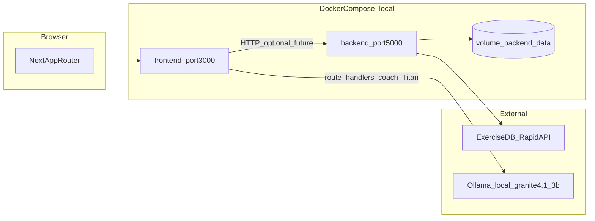

# Contexto del proyecto FitTrack

Documento de referencia para trabajo en frontend, backend, Docker y pruebas. **No incluye secretos:** usa solo `backend/.env.example` como plantilla; los valores reales viven en `backend/.env` (local) y no deben copiarse a la documentación.

---

## 1. Resumen ejecutivo

- **Frontend:** Next.js 16 (App Router), React 19, Tailwind v4, componentes en `components/ui` (shadcn/Radix). Gran parte del flujo actual es **demo/mock** (usuarios en memoria, `localStorage` para sesión y datos auxiliares).
- **Backend:** Flask, SQLAlchemy, JWT (`Flask-JWT-Extended`), CORS, Alembic. **Implementados:** autenticación (`/api/auth/*`), ejercicios (`/api/exercises/*`), usuarios (`/api/users/*`), rutinas (`/api/routines/*`), métricas (`/api/metrics/*`), membresías (`/api/memberships/*`), pagos (`/api/payments/*`), tasas de cambio (`/api/exchange-rates/*`), sesiones (`/api/sessions/*`), nutrición (`/api/nutrition/*`), notificaciones (`/api/notifications/*`), soporte (`/api/support/*`), admin overview (`/api/admin/overview`). Contratos en `docs/API_CONTRACTS.md`.
- **Membresía activa (gating atleta):** atletas con rol `user` **sin** `UserMembership` vigente solo acceden a `/dashboard`, `/memberships`, `/profile` y `/support` (UX en `lib/membership/access.ts`; barrera real en backend vía `require_active_membership`). Métricas, rutinas, sesiones y nutrición devuelven **403** con `code: membership_required`. La membresía se otorga al aprobar un pago (`POST /api/memberships/payment-requests/:id/approve`) o por asignación admin (`PUT /api/memberships/users/:id`). Entrenadores y admin **no** están sujetos a este gating.
- **IA / Coach "Titan":** asistente conversacional servido por **Ollama** (modelo `granite4.1:3b`) mediante rutas Next en `app/api/coach/*` y `app/api/nutrition/titan`. Genera motivación contextual, reseña de sesión de entrenamiento y estimación de calorías/macros. Requiere `ollama serve` local (`OLLAMA_BASE_URL`, default `http://localhost:11434`); incluye *fallbacks* si el modelo no está disponible. Acceso al asistente nutricional gateado a membresías Premium/Pro.
- **Nutrición:** módulo en `app/nutrition`, `components/nutrition/*`, `hooks/use-nutrition.ts` y `lib/nutrition/*`. Calcula metabolismo (Mifflin-St Jeor: BMR/TDEE), define macros objetivo, gestiona plan de comidas asignado por el entrenador, diario de alimentos (kcal y macros opcionales P/C/G), hidratación y adherencia. Con `NEXT_PUBLIC_DATA_SOURCE_NUTRITION=api` el diario y plan persisten en Flask; en modo `local` usa `localStorage`.
- **Datos:** SQLite por defecto; en Docker la URI apunta a un volumen (`/data/fitness_platform.db`).
- **Objetivo de este documento:** evitar redescubrir la arquitectura en cada tarea y alinear cambios con las reglas en `.cursor/rules/`.

---

## 2. Mapa de arquitectura



Hoy el navegador habla principalmente con Next; el backend está disponible en `localhost:5000` pero **el frontend no consume de forma sistemática la API Flask** (auth y muchas pantallas siguen en modo mock). Las rutas API de Next (`/api/coach/*`, `/api/nutrition/titan`) hablan directamente con **Ollama** para el coach Titan.

---

## 3. Inventario de rutas y responsabilidades

### Frontend (App Router)

| Área | Ruta(s) | Notas |
|------|---------|--------|
| Público | `/`, `/login`, `/register` | Login/register contra usuarios mock en `AuthProvider` |
| Usuario | `/dashboard`, `/routines`, `/metrics`, `/nutrition`, `/memberships`, `/profile`, `/support` | Protegidas por shell Phosphor Prime en `app/(athlete-prime)/*`. Sin membresía activa solo `/dashboard`, `/memberships`, `/profile`, `/support` (ver `lib/membership/access.ts`). Layout: [`components/athlete-prime/`](components/athlete-prime/) + `gainer-prime-theme.css`. |
| Admin V2 (pagos) | `/admin-v2/payments`, `/admin-v2/payment-methods`, `/admin-v2/exchange-rates`, `/admin-v2/support` | Aprobación de solicitudes de pago, CRUD métodos/tasas, tickets de soporte. Rol `admin`. |
| Trainer | `/trainer`, `/trainer/*` | Rol `trainer` (cliente). Gestiona atletas, rutinas, asignaciones, progreso y nutrición asignada (`/trainer/athletes/[athleteId]/nutrition`) |
| Admin | `/admin-v2`, `/admin-v2/*` | Plantilla oficial Phosphor V2. Rutas `/admin/*` redirigen aquí. Rol `admin` verificado en cliente. Incluye ejercicios, atletas, entrenadores, rutinas, membresías, asignaciones y nutrición por atleta |
| API Next (IA) | `/api/coach/titan`, `/api/coach/session-review`, `/api/nutrition/titan` | Route handlers que hablan con Ollama (coach Titan). No dependen de Flask |

### Backend (prefijo `/api`)

| Blueprint | Prefijo | Estado |
|-----------|---------|--------|
| `auth_bp` | `/api/auth` | Implementado (register, login, JWT, etc.) |
| `exercises_bp` | `/api/exercises` | Implementado (cache + API externa) |
| `users_bp`, `routines_bp`, `memberships_bp`, `metrics_bp`, `sessions_bp`, `nutrition_bp`, `payments_bp`, `exchange_rates_bp`, `notifications_bp`, `support_bp`, `admin_bp` | `/api/users`, `/api/routines`, … | Implementados (servicios + autorización JWT + gating membresía en dominios atleta) |

Health: `GET /api/health` → `{ "status": "ok" }`.

---

## 4. Archivos clave (donde tocar con criterio)

| Tema | Ruta |
|------|------|
| Auth mock frontend | `app/context/auth-context.tsx` |
| Rutas protegidas (UX) | `components/auth/protected-route.tsx` |
| Admin / datos demo | `hooks/use-admin.ts` |
| Admin V2 (Phosphor Reactor Deck) — **plantilla admin oficial** | `app/admin-v2/*`, `components/admin-v2/*`, `styles/gainer-prime-theme.css` — ver [`docs/PHOSPHOR_REACTOR_CONTEXT.md`](./PHOSPHOR_REACTOR_CONTEXT.md) |
| Atleta (Phosphor Prime) — **shell usuario oficial** | `app/(athlete-prime)/*`, `components/athlete-prime/*`, mismo tema `gainer-prime-theme.css` |
| Métricas demo | `hooks/use-metrics.ts` |
| Membresías demo | `hooks/use-memberships.ts` |
| Gating membresía atleta (UX) | `lib/membership/access.ts` — rutas permitidas sin plan, filtro de nav |
| Gating membresía atleta (API) | `backend/app/utils/authorization.py` — `require_active_membership` |
| Pagos y solicitudes membresía | `backend/app/routes/memberships.py`, `backend/app/services/payment_service.py`, `hooks/use-payment-methods.ts`, `hooks/use-payment-requests.ts` |
| Notificaciones en tiempo real | `app/context/realtime-context.tsx`, `lib/realtime/socket.ts`, `backend/app/routes/notifications.py` |
| Coach IA (estado/orquestación) | `app/context/coach-context.tsx`, `components/coach/coach-mascot.tsx` |
| Cliente y prompts Ollama | `lib/ollama/client.ts`, `lib/ollama/prompts.ts`, `lib/ollama/types.ts` |
| Rutas API Titan (Next) | `app/api/coach/titan/route.ts`, `app/api/coach/session-review/route.ts`, `app/api/nutrition/titan/route.ts` |
| Nutrición (estado/lógica) | `hooks/use-nutrition.ts`, `lib/nutrition/*` (`metabolism.ts`, `types.ts`, `storage.ts`) |
| Nutrición (UI) | `app/(athlete-prime)/nutrition/*`, `components/nutrition/*` |
| Rutinas atleta (plan semanal) | `hooks/use-athlete-data.ts`, `components/routines/assigned-routine-view.tsx`. Con `ROUTINES=api`, el detalle del día resuelve rutinas vía `getRoutineById` (no `state.routines` local). Si hay plan semanal activo, la UI del atleta prioriza el plan; la asignación única es fallback sin plan. |
| Factory Flask, CORS, JWT | `backend/app/__init__.py` |
| Config y env | `backend/app/config.py`, `backend/.env.example` |
| Modelos ORM | `backend/app/models.py` |
| Rutas auth | `backend/app/routes/auth.py` |
| Registro de blueprints | `backend/app/routes/__init__.py` |
| Servicio auth | `backend/app/services/auth_service.py` |
| ExerciseDB + caché | `backend/app/services/exercise_api_service.py` |
| Docker local | `docker-compose.yml`, `Dockerfile.frontend`, `backend/Dockerfile` |
| Build Next | `next.config.mjs` |
| Pruebas manuales | `TEST_ADMIN.md`, `TEST_METRICS.md` |

---

## 5. Estado por capa (evitar confusiones)

| Capa | Implementado | Mock / demo | Pendiente o riesgo |
|------|----------------|-------------|---------------------|
| UI + navegación | Sí | Auth, métricas, membresías, mucho admin | Conectar a API real con contrato estable |
| Protección admin | Solo en cliente (UX); backend valida rol vs BD | — | Barrera real en backend (Fase 2): `role_required` revalida rol e `is_active` contra BD |
| API Flask auth + JWT | Sí | — | Registro público fuerza `role='user'`; revalidación JWT vs BD resuelta en Fase 2 (`user_lookup_loader` rechaza inactivo; `/api/auth/me` devuelve 401 si desactivado) |
| Autorización por recurso (rutinas) | Sí (Fase 2) | — | `can_manage_routine`/`can_read_routine` impiden IDOR en GET/PATCH/DELETE, assign/unassign y weekly-plan |
| Membresías de usuario | Sí (Fase 2 + pagos) | — | `UserMembership` se asigna/revoca de verdad; alta vía aprobación de pago o admin; gating activo en métricas/rutinas/sesiones/nutrición para `role=user` sin plan vigente |
| Pagos y tasas de cambio | Sí | — | Solicitudes con comprobante (`multipart`), métodos de pago, tasas USD→VES; aprobación admin activa membresía |
| Gating membresía atleta | Sí (frontend + backend) | — | UX: `lib/membership/access.ts`; API: `require_active_membership` → 403 `membership_required`. Titan sigue con gating Premium/Pro aparte |
| Validación de entrada | Pydantic v2 (Fase 2) | — | Nutrición, weekly-plan y `setLogs` validados; errores genéricos sin `str(e)` |
| Rate limiting | Flask-Limiter (Fase 2) | — | `login`/`register`/`change-password`; storage `memory://` dev, Redis en prod (`RATELIMIT_STORAGE_URI`) |
| API ejercicios | Sí | — | Requiere clave RapidAPI en env; `clear-cache` con `@role_required('admin')` |
| Users / routines / memberships / metrics / sessions / nutrition API | Implementados | — | Frontend: adaptador remoto cableado por dominio (Fase 1: overview admin, CRUD planes, patch/asignación atleta); default sigue `local` |
| Coach IA "Titan" (rutas Next + Ollama) | Sí | — | Fase 3: introspección JWT vía Flask `/api/auth/me`, gating membresía/rol server-side, rate limit por `userId`, `middleware.ts` ligero, fallbacks servidor si Ollama cae |
| Nutrición (metabolismo, macros, plan, diario) | UI + API Flask cuando `NEXT_PUBLIC_DATA_SOURCE_NUTRITION=api` | Modo `local`: `localStorage` | Coach/admin leen diario del atleta; interceptor 401 global (Sprint 4) |
| Typecheck en build | `ignoreBuildErrors: false` en Next | — | Build puede fallar si hay errores TS; ESLint no se ignora en build |
| `.env` en repo | `.gitignore` ignora `.env`, `.env*.local`, `backend/.env` y `backend/fitness_platform.db` (Fase 0) | — | No versionar secretos ni la DB local |

---

## 6. Flujos actuales (resumidos)

1. **Login frontend:** valida contra `MOCK_USERS` en `auth-context.tsx`, guarda `user` y `access_token` ficticio en `localStorage`.
2. **Register frontend:** crea usuario en memoria + `localStorage`; no llama a `/api/auth/register`.
3. **ProtectedRoute:** redirige a `/login` si no hay usuario; comprueba `requiredRole` solo en cliente.
4. **Backend register:** persiste usuario con rol forzado `'user'` en la ruta (`auth.py`); el body `role` del cliente se ignora.
5. **Ejercicios:** servicio intenta caché en SQLite; si no hay datos, llama a ExerciseDB y persiste ejercicios cacheados.
6. **Métricas (piloto API):** con `NEXT_PUBLIC_AUTH_SOURCE=api` y/o `NEXT_PUBLIC_DATA_SOURCE_METRICS=api`, el frontend resuelve `athleteId` como `user.id` del JWT (no usa el mapa demo `EMAIL_TO_ATHLETE_ID`). En backend, `athleteId` ≡ `users.id` ≡ `metrics_history.user_id`. El mapa demo y seeds solo aplican en modo fully-local.
7. **Rutinas/sesiones (piloto API):** con `NEXT_PUBLIC_DATA_SOURCE_ROUTINES=api`, entrenador y atleta comparten datos vía Flask: listados (`GET /api/routines/`, `GET /api/routines/assignments`), CRUD/asignaciones del entrenador y lectura/completar sesión del atleta (`/api/routines/*`, `/api/sessions/*`).
8. **Datos auxiliares atleta (piloto API):** con `NEXT_PUBLIC_DATA_SOURCE_USERS=api` → tarjeta “Mi entrenador”; `NEXT_PUBLIC_DATA_SOURCE_NUTRITION=api` → plan nutricional asignado y diario persistido en Flask; `NEXT_PUBLIC_DATA_SOURCE_MEMBERSHIPS=api` → membresía activa.
9. **Resolución de atleta en nutrición API:** si `NEXT_PUBLIC_DATA_SOURCE_NUTRITION=api`, `resolveAthleteId` debe usar `user.id` del JWT igual que métricas/rutinas. Páginas coach/admin de nutrición deben cargar el atleta con API (`getAthleteById`) en lugar de seeds (`findAthleteById`).
10. **Gating membresía atleta:** sin `UserMembership` vigente (`end_date` futura, `is_active=true`), el atleta con rol `user` recibe **403** en métricas, rutinas (`/my`, weekly-plan, GET por id), sesiones y nutrición (plan + diario). Frontend restringe nav y rutas a `/dashboard`, `/memberships`, `/profile`, `/support`. Flujo de alta: atleta envía solicitud de pago con comprobante → admin aprueba → `MembershipService.assign_membership_on_payment` activa el plan.
11. **Tests backend y membresía:** el fixture `athlete_user` en `backend/tests/conftest.py` **no** incluye membresía por defecto (para cubrir el caso negativo en `TestPaymentFlow`). Los tests de dominio atleta usan `grant_active_membership` vía fixture `athlete_membership` (autouse en clases de métricas, rutinas, sesiones y nutrición).

---

## 7. Docker local (desarrollo)

Desde la raíz del repo:

```powershell
docker compose -p fittrack up --build -d
```

- Frontend: `http://localhost:3000`
- Backend: `http://localhost:5000/api/health`
- `docker-compose.yml` monta volumen `backend_data` y fuerza `DATABASE_URL` a SQLite bajo `/data`.
- Variables frontend en compose (piloto híbrido): `AUTH_SOURCE=api`, `DATA_SOURCE=local`, overrides `METRICS`, `ROUTINES`, `USERS`, `NUTRITION`, `MEMBERSHIPS` en `api`. Con auth API, `athleteId` debe ser el `user.id` del JWT.
- Requiere archivo `backend/.env` para variables adicionales (ver ejemplo en `backend/.env.example`). Si el puerto `5000` está ocupado, detén el otro contenedor o ajusta el mapeo de puertos.

Apagar:

```powershell
docker compose -p fittrack down
```

---

## 8. Cumplimiento frente a `.cursor/rules` (guía rápida)

Las reglas completas están en `.cursor/rules/*.mdc`. Aquí solo se cruza **estado del repo vs intención de la regla**; no sustituye leer cada archivo.

| Área de regla | Intención | Observación en este repo |
|---------------|-----------|---------------------------|
| `security-core.mdc` | Sin secretos en código; errores genéricos al cliente | Revisar que nuevos cambios no logueen tokens ni PII; algunos mensajes de error aún pueden filtrar detalle — alinear al endurecer API |
| `env-config-security.mdc` | `.env` real fuera de repo; sin defaults inseguros en prod | Usar solo `JWT_SECRET_KEY` fuerte en entornos reales; `config.py` tiene fallback de desarrollo — documentar y no usar en producción |
| `auth-authorization.mdc` | Permisos reales en backend | Admin y rutas sensibles hoy dependen del cliente; integración futura debe validar JWT/rol en servidor |
| `python-backend-security.mdc` | CORS estricto; sin roles desde registro abusivo | CORS en compose apunta a `http://localhost:3000`; endpoint register acepta `role` del body — **gap** a corregir cuando se endurezca auth |
| `frontend-security.mdc` | No tratar `localStorage` como almacén seguro para tokens reales | Tokens actuales son mock — si se integra JWT real, usar cookies httpOnly o patrón acordado con backend |
| `backend-architecture.mdc` | Rutas delgadas; lógica en `services` | Mantener al añadir rutas reales a blueprints placeholder |
| `database-security-and-design.mdc` | Integridad y no borrado destructivo sin plan | Modelos amplios; migraciones no vía Alembic en árbol — cambios de esquema con cuidado |
| `task-validation-and-testing.mdc` / `testing-standards.mdc` | Cada tarea cierra con validación explícita | Hay guías manuales `TEST_*.md`; añadir tests automatizados cuando se toquen flujos críticos |
| `frontend-structure-and-reuse.mdc` | Reutilizar `components/ui` | Preferir composición sobre duplicar estilos |
| `accessibility-frontend.mdc` / `seo-next.mdc` | a11y y metadata | Revisar al crear páginas nuevas en `app/` |

---

## 9. Checklist antes de cerrar una tarea

1. ¿El cambio toca auth, roles o datos sensibles? → Casos positivo/negativo y revisión de reglas de seguridad.
2. ¿Nueva variable de entorno? → Documentar en `backend/.env.example` (sin valores secretos).
3. ¿Nuevo endpoint? → Validación de entrada, respuesta de error consistente, permisos en servidor.
4. ¿Cambios en frontend (TS/React)? → `npm run lint`, `npm run typecheck`, `npm run build` y prueba manual del flujo afectado. Config: [eslint.config.mjs](../eslint.config.mjs) (ESLint 9 + `eslint-config-next`; reglas experimentales de React Compiler en hooks desactivadas por incompatibilidad con patrones actuales del repo).
5. ¿Docker? → `docker compose -p fittrack config` y arranque local si aplica.

---

## 10. Pendientes (retomar al arrancar backend)

> Items conocidos que **no** se abordan todavía y deben revisarse cuando se inicie el trabajo de backend, junto con el endurecimiento general de seguridad.

- **[Seguridad] Autenticación/autorización en rutas IA de Next.** Las rutas Titan aplican `applyRouteGuard` (Bearer + rate limit), pero en modo `api` **no verifican JWT real** ni membresía desde claims; el gating nutricional confía en campos del body. Ver Fase 3 en [plan-actual.md](./plan-actual.md).
- **[Seguridad] Endurecimiento auth general.** Con `NEXT_PUBLIC_AUTH_SOURCE=api` el frontend usa JWT real vía `lib/auth/auth-client.remote.ts`; en modo `local` (default) persiste sesión mock en `localStorage`. La protección de rutas del frontend sigue siendo UX, pero la autorización por recurso en Flask ya está endurecida (Fase 2: ownership de rutinas, revalidación JWT vs BD, rate limiting, validación Pydantic). Falta la capa IA "Titan" (Fase 3).

---

## 11. Integración frontend ↔ backend (Fase 5)

Adaptadores activos por flags de entorno. Contratos: [API_CONTRACTS.md](./API_CONTRACTS.md). Plan de ejecución: [plan-actual.md](./plan-actual.md) (Fase 1 **culminada** jun 2026).

| Capa | Archivo | Comportamiento |
|------|---------|----------------|
| Auth | `lib/auth/auth-client.ts` | Factory `local` (mock) \| `api` (Flask `/api/auth/*`) |
| Sesión | `lib/auth/session-store.ts` | Punto único para token/usuario; preparado para httpOnly |
| Datos | `lib/data/client.ts` | Facade → `client.local.ts` \| `client.remote.ts` (HTTP a Flask) |
| HTTP | `lib/api/http-client.ts` | `fetch` + Bearer desde session-store |

Variables en `.env.local.example`:

- `NEXT_PUBLIC_API_BASE_URL` — base Flask (default `http://localhost:5000`)
- `NEXT_PUBLIC_AUTH_SOURCE` — `local` \| `api` (default `local`)
- `NEXT_PUBLIC_DATA_SOURCE` — `local` \| `api` (default `local`)
- Overrides por dominio (default heredan `DATA_SOURCE`): `NEXT_PUBLIC_DATA_SOURCE_METRICS`, `_ROUTINES`, `_USERS`, `_NUTRITION`, `_MEMBERSHIPS`

Validación local: `npm run lint` → `npm run typecheck` → `npm run build`. Prueba manual en modo `local`; con backend levantado, modo API: login con `AUTH_SOURCE=api` y guía [TEST_FASE1_API.md](../TEST_FASE1_API.md).

**Backend (Flask):** blueprints implementados en `backend/app/routes/` con servicios en `backend/app/services/`. Migraciones: `docs/MIGRATIONS.md`. Setup: `backend/README.md`. Tests: `cd backend && python -m pytest` (168 tests; Python 3.11–3.14; SQLAlchemy ≥ 2.0.49 para 3.14). Frontend: `npm test` (83 tests Vitest).

**Instalación de dependencias:** `socket.io-client` es dependencia de realtime; tras clonar, ejecutar `pnpm install`. En entornos con proxy/certificado corporativo puede requerirse `NODE_OPTIONS=--use-system-ca` antes de `pnpm install`.


## 12. Mantenimiento de este documento

Actualiza este archivo cuando:

- se conecte el frontend al backend de forma real,
- se implementen blueprints placeholder,
- cambien puertos, variables de entorno o flujo de despliegue,
- se introduzcan tests automatizados o se deprecie el modo mock.

Última orientación (jun 2026): el frontend expone adaptadores (`local` \| `api`) documentados en [API_CONTRACTS.md](./API_CONTRACTS.md). El modo **local** sigue siendo el default para demo; activar `api` por dominio cuando se valide el flujo (piloto Docker o `.env.local`). Fase 1 del [plan-actual.md](./plan-actual.md) conectó overview admin, CRUD de planes y operaciones admin de usuarios. **Gating membresía atleta** activo en frontend (`lib/membership/access.ts`) y backend (`require_active_membership`); flujo de pagos con aprobación admin documentado en `TestPaymentFlow` (`backend/tests/test_api_domains.py`).
