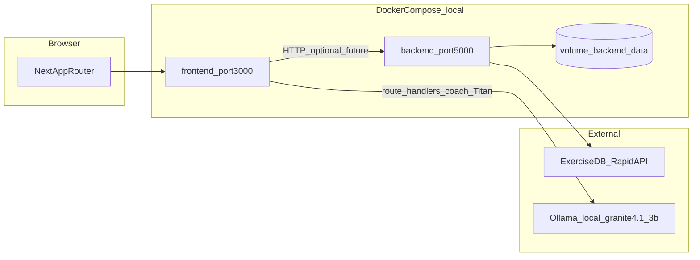

# Contexto del proyecto Be a Gainer

Documento de referencia para trabajo en frontend, backend, Docker y pruebas. **No incluye secretos:** usa solo `backend/.env.example` como plantilla; los valores reales viven en `backend/.env` (local) y no deben copiarse a la documentación.

---

## 1. Resumen ejecutivo

- **Frontend:** Next.js 16 (App Router), React 19, Tailwind v4, componentes en `components/ui` (shadcn/Radix). **Docker dev y prod** usan modo API completo (`AUTH_SOURCE=api`, todos los `DATA_SOURCE_*=api`). Sin Docker, el default en `.env.local.example` es modo `local` (mock/`localStorage`).
- **Backend:** Flask, SQLAlchemy, JWT (`Flask-JWT-Extended`), CORS, Alembic. **Implementados:** autenticación (`/api/auth/*`), ejercicios (`/api/exercises/*`), usuarios (`/api/users/*`), rutinas (`/api/routines/*`), métricas (`/api/metrics/*`), membresías (`/api/memberships/*`), pagos (`/api/payments/*`), tasas de cambio (`/api/exchange-rates/*`), sesiones (`/api/sessions/*`), nutrición (`/api/nutrition/*`), notificaciones (`/api/notifications/*`), soporte (`/api/support/*`), admin overview (`/api/admin/overview`). Contratos en `docs/API_CONTRACTS.md`.
- **Membresía activa (gating atleta):** atletas con rol `user` **sin** `UserMembership` vigente solo acceden a `/dashboard`, `/memberships`, `/profile` y `/support` (UX en `lib/membership/access.ts`; barrera real en backend vía `require_active_membership`). Métricas, rutinas, sesiones y nutrición devuelven **403** con `code: membership_required`. La membresía se otorga al aprobar un pago (`POST /api/memberships/payment-requests/:id/approve`) o por asignación admin (`PUT /api/memberships/users/:id`). Entrenadores y admin **no** están sujetos a este gating.
- **IA / Coach "Titan":** asistente conversacional servido por **Ollama** (modelo `granite4.1:3b`) mediante rutas Next en `app/api/coach/*` y `app/api/nutrition/titan`. Genera motivación contextual, reseña de sesión de entrenamiento y estimación de calorías/macros. Requiere `ollama serve` local (`OLLAMA_BASE_URL`, default `http://localhost:11434`); incluye *fallbacks* si el modelo no está disponible. Acceso al asistente nutricional gateado a membresías Premium/Pro.
- **Nutrición:** módulo en `app/nutrition`, `components/nutrition/*`, `hooks/use-nutrition.ts` y `lib/nutrition/*`. Calcula metabolismo (Mifflin-St Jeor: BMR/TDEE), define macros objetivo, gestiona plan de comidas asignado por el entrenador, diario de alimentos (kcal y macros opcionales P/C/G), hidratación y adherencia. Con `NEXT_PUBLIC_DATA_SOURCE_NUTRITION=api` el diario y plan persisten en Flask; en modo `local` usa `localStorage`.
- **Datos:** SQLite por defecto; en Docker la URI apunta a un volumen (`/data/fitness_platform.db`).
- **Objetivo de este documento:** evitar redescubrir la arquitectura en cada tarea y alinear cambios con las reglas en `.cursor/rules/`.

---

## 2. Mapa de arquitectura



Hoy el navegador habla con Next (UI + rutas Titan) y con Flask (datos de negocio vía adaptador remoto cuando `AUTH_SOURCE=api` / `DATA_SOURCE=api`). En Docker dev y prod el frontend **siempre** usa API. Las rutas Next (`/api/coach/*`, `/api/nutrition/titan`) hablan con **Ollama** para el coach Titan (con fallback si no está disponible).

---

## 3. Inventario de rutas y responsabilidades

### Frontend (App Router)

| Área | Ruta(s) | Notas |
|------|---------|--------|
| Público | `/`, `/login`, `/register`, `/activate` | Con `AUTH_SOURCE=api`: login/register contra Flask JWT |
| Atleta (oficial) | `/dashboard`, `/routines`, `/metrics`, `/nutrition`, `/memberships`, `/profile`, `/support` | Shell Phosphor Prime en `app/(athlete-prime)/*`. Gating membresía: `lib/membership/access.ts` |
| Admin (oficial) | `/admin-v2`, `/admin-v2/*` | Pagos, métodos, tasas, soporte, atletas, trainers, rutinas, membresías, asignaciones. `/admin/*` redirige aquí |
| Trainer (oficial) | `/trainer-v2`, `/trainer-v2/*` | Atletas, rutinas, asignaciones, progreso, nutrición por atleta. `/trainer/*` redirige aquí |
| API Next (IA) | `/api/coach/titan`, `/api/coach/session-review`, `/api/nutrition/titan` | Ollama + guard JWT server-side |

**Código legacy:** `app/admin/*` y `app/trainer/*` siguen en el árbol pero redirigen a v2; candidatos a eliminación (ver [PRODUCTION_READINESS.md](./PRODUCTION_READINESS.md)).

### Backend (prefijo `/api`)

| Blueprint | Prefijo | Estado |
|-----------|---------|--------|
| `auth_bp` | `/api/auth` | Implementado (register, login, JWT, etc.) |
| `exercises_bp` | `/api/exercises` | Implementado (cache + API externa) |
| `users_bp`, `routines_bp`, `memberships_bp`, `metrics_bp`, `sessions_bp`, `nutrition_bp`, `payments_bp`, `exchange_rates_bp`, `notifications_bp`, `support_bp`, `admin_bp` | `/api/users`, `/api/routines`, … | Implementados (servicios + autorización JWT + gating membresía en dominios atleta) |

Health: `GET /api/health` → `{ "status": "ok" }`.

---

## 4. Archivos clave (donde tocar con criterio)

| Tema | Ruta |
|------|------|
| Auth mock frontend | `app/context/auth-context.tsx` |
| Rutas protegidas (UX) | `components/auth/protected-route.tsx` |
| Admin / datos demo | `hooks/use-admin.ts` |
| Admin V2 (Phosphor Reactor Deck) — **plantilla admin oficial** | `app/admin-v2/*`, `components/admin-v2/*`, `styles/gainer-prime-theme.css` — ver [`docs/PHOSPHOR_REACTOR_CONTEXT.md`](./PHOSPHOR_REACTOR_CONTEXT.md) |
| Atleta (Phosphor Prime) — **shell usuario oficial** | `app/(athlete-prime)/*`, `components/athlete-prime/*`, mismo tema `gainer-prime-theme.css` |
| Métricas demo | `hooks/use-metrics.ts` |
| Membresías demo | `hooks/use-memberships.ts` |
| Gating membresía atleta (UX) | `lib/membership/access.ts` — rutas permitidas sin plan, filtro de nav |
| Gating membresía atleta (API) | `backend/app/utils/authorization.py` — `require_active_membership` |
| Pagos y solicitudes membresía | `backend/app/routes/memberships.py`, `backend/app/services/payment_service.py`, `hooks/use-payment-methods.ts`, `hooks/use-payment-requests.ts` |
| Notificaciones en tiempo real | `app/context/realtime-context.tsx`, `lib/realtime/socket.ts`, `backend/app/routes/notifications.py` |
| Coach IA (estado/orquestación) | `app/context/coach-context.tsx`, `components/coach/coach-mascot.tsx` |
| Cliente y prompts Ollama | `lib/ollama/client.ts`, `lib/ollama/prompts.ts`, `lib/ollama/types.ts` |
| Rutas API Titan (Next) | `app/api/coach/titan/route.ts`, `app/api/coach/session-review/route.ts`, `app/api/nutrition/titan/route.ts` |
| Nutrición (estado/lógica) | `hooks/use-nutrition.ts`, `lib/nutrition/*` (`metabolism.ts`, `types.ts`, `storage.ts`) |
| Nutrición (UI) | `app/(athlete-prime)/nutrition/*`, `components/nutrition/*` |
| Rutinas atleta (plan semanal) | `hooks/use-athlete-data.ts`, `components/routines/assigned-routine-view.tsx`. Con `ROUTINES=api`, el detalle del día resuelve rutinas vía `getRoutineById` (no `state.routines` local). Si hay plan semanal activo, la UI del atleta prioriza el plan; la asignación única es fallback sin plan. |
| Factory Flask, CORS, JWT | `backend/app/__init__.py` |
| Config y env | `backend/app/config.py`, `backend/.env.example` |
| Modelos ORM | `backend/app/models.py` |
| Rutas auth | `backend/app/routes/auth.py` |
| Registro de blueprints | `backend/app/routes/__init__.py` |
| Servicio auth | `backend/app/services/auth_service.py` |
| ExerciseDB + caché | `backend/app/services/exercise_api_service.py` |
| Docker local | `docker-compose.yml`, `Dockerfile.frontend`, `backend/Dockerfile` |
| Build Next | `next.config.mjs` |
| Pruebas manuales | `TEST_ADMIN.md`, `TEST_METRICS.md` |

---

## 5. Estado por capa (evitar confusiones)

| Capa | Implementado | Mock / demo | Pendiente o riesgo |
|------|----------------|-------------|---------------------|
| UI + navegación | Sí | Solo en modo `local` sin Docker | Shells oficiales: athlete-prime, admin-v2, trainer-v2 |
| Protección rutas (UX) | Sí | — | `ProtectedRoute` es cliente; barrera real en Flask |
| API Flask auth + JWT | Sí | — | JWT en `localStorage` (riesgo XSS); sin refresh token |
| Autorización por recurso | Sí | — | Ownership rutinas, revalidación JWT vs BD |
| Membresías + pagos | Sí | — | Resend operativo pendiente si `RESEND_API_KEY` vacía |
| Adaptador remoto frontend | Sí (~97 funciones) | Modo `local` en `.env.local.example` | Endpoints huérfanos menores (ejercicios admin, clear-cache) |
| Coach Titan | Sí | — | Rate limit en memoria; Redis pendiente (Fase 7.7) |
| Typecheck / build | Sí | — | `ignoreBuildErrors: false` |
| Producción | Parcial | — | Ver [PRODUCTION_READINESS.md](./PRODUCTION_READINESS.md) |

---

## 6. Flujos actuales (resumidos)

**Modo API (Docker dev/prod, o `.env.local.api.example`):**

1. **Login/register:** `lib/auth/auth-client.remote.ts` → Flask `/api/auth/login|register`; JWT en `localStorage` vía `session-store.ts`.
2. **ProtectedRoute:** redirige en cliente; API valida JWT y roles en cada request.
3. **Datos:** `lib/data/client.remote.ts` (~97 funciones) → Flask por dominio.
4. **Membresía atleta:** gating UX + `require_active_membership` en API; alta vía pago aprobado o asignación admin.
5. **Invitaciones trainer:** admin invita → Resend (o simulado sin API key) → `/activate?token=...`.
6. **Titan:** rutas Next con introspección JWT vía `/api/auth/me`, rate limit por userId, fallback si Ollama cae.

**Modo local (solo sin Docker, `.env.local.example`):**

1. Auth y datos en mock/`localStorage`; seeds demo en hooks locales.
2. Útil para desarrollo UI aislado; no representa el flujo de producción.

**Tests backend:** `athlete_user` sin membresía por defecto; dominios atleta usan fixture `athlete_membership`.

---

## 7. Docker local (desarrollo)

Desde la raíz del repo:

```powershell
docker compose -p fittrack up --build -d
```

- Frontend: `http://localhost:3000`
- Backend: `http://localhost:5000/api/health`
- `docker-compose.yml` monta volumen `backend_data` y fuerza `DATABASE_URL` a SQLite bajo `/data`.
- Variables frontend en compose: **modo API completo** (`AUTH_SOURCE=api`, `DATA_SOURCE=api`, todos los overrides en `api`).
- **Hosting / prod:** [DEPLOY_MAC_MINI.md](./DEPLOY_MAC_MINI.md) (`docker-compose.prod.yml`). **Go-live:** [PRODUCTION_READINESS.md](./PRODUCTION_READINESS.md).

Apagar:

```powershell
docker compose -p fittrack down
```

---

## 8. Cumplimiento frente a `.cursor/rules` (guía rápida)

Las reglas completas están en `.cursor/rules/*.mdc`. Aquí solo se cruza **estado del repo vs intención de la regla**; no sustituye leer cada archivo.

| Área de regla | Intención | Observación en este repo |
|---------------|-----------|---------------------------|
| `security-core.mdc` | Sin secretos en código; errores genéricos al cliente | Revisar que nuevos cambios no logueen tokens ni PII; algunos mensajes de error aún pueden filtrar detalle — alinear al endurecer API |
| `env-config-security.mdc` | `.env` real fuera de repo; sin defaults inseguros en prod | Usar solo `JWT_SECRET_KEY` fuerte en entornos reales; `config.py` tiene fallback de desarrollo — documentar y no usar en producción |
| `auth-authorization.mdc` | Permisos reales en backend | Flask valida JWT/rol en endpoints; UX en cliente es capa adicional |
| `frontend-security.mdc` | No tratar `localStorage` como almacén seguro | JWT real en `localStorage` en modo API — migrar a httpOnly (Fase 13.3) |
| `database-security-and-design.mdc` | Integridad y migraciones | Alembic 001–012; `init_db()` también llama `create_all()` al arrancar |
| `task-validation-and-testing.mdc` / `testing-standards.mdc` | Cada tarea cierra con validación explícita | Hay guías manuales `TEST_*.md`; añadir tests automatizados cuando se toquen flujos críticos |
| `frontend-structure-and-reuse.mdc` | Reutilizar `components/ui` | Preferir composición sobre duplicar estilos |
| `accessibility-frontend.mdc` / `seo-next.mdc` | a11y y metadata | Revisar al crear páginas nuevas en `app/` |

---

## 9. Checklist antes de cerrar una tarea

1. ¿El cambio toca auth, roles o datos sensibles? → Casos positivo/negativo y revisión de reglas de seguridad.
2. ¿Nueva variable de entorno? → Documentar en `backend/.env.example` (sin valores secretos).
3. ¿Nuevo endpoint? → Validación de entrada, respuesta de error consistente, permisos en servidor.
4. ¿Cambios en frontend (TS/React)? → `npm run lint`, `npm run typecheck`, `npm run build` y prueba manual del flujo afectado. Config: [eslint.config.mjs](../eslint.config.mjs) (ESLint 9 + `eslint-config-next`; reglas experimentales de React Compiler en hooks desactivadas por incompatibilidad con patrones actuales del repo).
5. ¿Docker? → `docker compose -p fittrack config` y arranque local si aplica.

---

## 10. Deuda conocida para producción

Ver checklist completo y veredicto en **[PRODUCTION_READINESS.md](./PRODUCTION_READINESS.md)**.

Resumen: runtime Flask dev (Werkzeug), sin healthchecks Docker, Resend no configurado = invitaciones simuladas, JWT en localStorage, sin `/terms`, SQLite single-node, código legacy `app/admin`/`app/trainer`.

---

## 11. Integración frontend ↔ backend

Adaptadores activos por flags de entorno. Contratos: [API_CONTRACTS.md](./API_CONTRACTS.md). Plan de ejecución: [plan-actual.md](./plan-actual.md) (Fase 1 **culminada** jun 2026).

| Capa | Archivo | Comportamiento |
|------|---------|----------------|
| Auth | `lib/auth/auth-client.ts` | Factory `local` (mock) \| `api` (Flask `/api/auth/*`) |
| Sesión | `lib/auth/session-store.ts` | Punto único para token/usuario; preparado para httpOnly |
| Datos | `lib/data/client.ts` | Facade → `client.local.ts` \| `client.remote.ts` (HTTP a Flask) |
| HTTP | `lib/api/http-client.ts` | `fetch` + Bearer desde session-store |

Variables en `.env.local.example`:

- `NEXT_PUBLIC_API_BASE_URL` — base Flask (default `http://localhost:5000`)
- `NEXT_PUBLIC_AUTH_SOURCE` — `local` \| `api` (default `local`)
- `NEXT_PUBLIC_DATA_SOURCE` — `local` \| `api` (default `local`)
- Overrides por dominio (default heredan `DATA_SOURCE`): `NEXT_PUBLIC_DATA_SOURCE_METRICS`, `_ROUTINES`, `_USERS`, `_NUTRITION`, `_MEMBERSHIPS`

Validación local: `npm run lint` → `npm run typecheck` → `npm run build`. Prueba manual en modo `local`; con backend levantado, modo API: login con `AUTH_SOURCE=api` y guía [TEST_FASE1_API.md](../TEST_FASE1_API.md).

**Backend (Flask):** blueprints en `backend/app/routes/`. Migraciones Alembic **001–012** (`docs/MIGRATIONS.md`). Tests: `cd backend && python -m pytest` (**~197 tests**, jun 2026). Frontend: `pnpm test` (**95 tests** Vitest, 23 archivos). CI: `.github/workflows/ci.yml`.

**Instalación de dependencias:** `socket.io-client` es dependencia de realtime; tras clonar, ejecutar `pnpm install`. En entornos con proxy/certificado corporativo puede requerirse `NODE_OPTIONS=--use-system-ca` antes de `pnpm install`.


## 12. Mantenimiento de este documento

Actualiza este archivo cuando:

- se conecte el frontend al backend de forma real,
- se implementen blueprints placeholder,
- cambien puertos, variables de entorno o flujo de despliegue,
- se introduzcan tests automatizados o se deprecie el modo mock.

Última orientación (jun 2026): modo **API** es el flujo principal en Docker. Modo **local** solo para dev UI sin backend. Go-live: [PRODUCTION_READINESS.md](./PRODUCTION_READINESS.md). Plan vivo: [plan-actual.md](./plan-actual.md).
